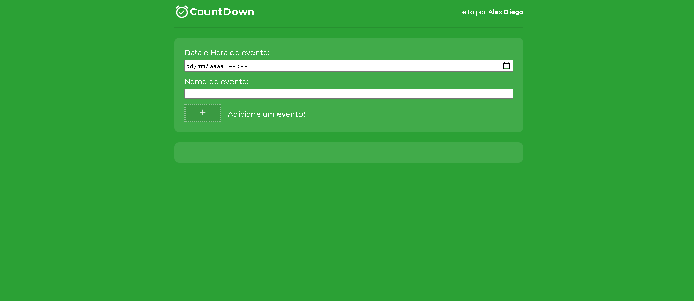

# CountDown-Timer

 
## ✔ Finalizado
### Funcionalidades:
- ✅ O usuário pode definir o evento inserindo seu nome, a data programada para ocorrer e um horário para o evento.
- ✅ O usuário pode ver uma mensagem de aviso se o nome do evento estiver em branco.
- ✅ O usuário pode ver uma mensagem de aviso se o tempo até os dados do evento e o tempo que foi inserido ultrapassar a precisão do cronômetro de contagem regressiva.
- ✅ O usuário pode clicar no botão 'Iniciar' para ver a contagem regressiva começar exibindo os dias, horas, minutos e segundos até que o evento ocorra.
- ✅ O usuário pode ver os elementos no cronômetro de contagem regressiva que diminuem automaticamente. Por exemplo, quando a contagem dos segundos restantes chega a 0, a contagem dos minutos restantes diminuirá em 1 e os segundos começarão a contagem regressiva a partir de 59. Essa progressão deve ocorrer dos segundos até a posição dos dias restantes no display de contagem regressiva.

### Bonus features:
- ✅ O usuário pode salvar o evento para que ele persista nas sessões.
- ✅ O usuário pode ver um alerta quando o evento é alcançado.
- ✅ O usuário pode especificar mais de um evento.
- ✅ O usuário pode ver um cronômetro de contagem regressiva para cada evento que foi definido.

## Sobre:
Um cronômetro de contagem regressiva para fornecer uma exibição continuamente decrescente dos dias, horas, minutos e segundos para um evento inserido pelo usuário.

Ideia do projeto retirado do repositorio: [App Ideas Collection](https://github.com/florinpop17/app-ideas)